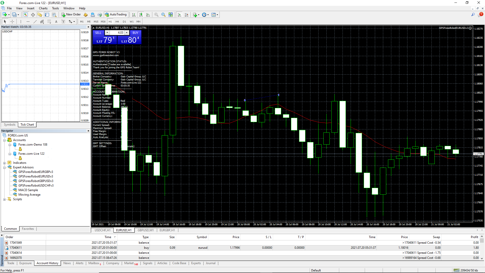

# Tokenomics

|**Token Name:** Replica Forex|
|-----------------------------|
|**Token Symbol:** RFX|
|---------------------|
|**Token Supply:** 10,000,000|
|----------------------------|
|**Token Protocol:** BEP20|
|-------------------------|
|**Smart Contract:** 0xc1c8056dd9a0cd81146038c44439c18b0aaa5e36|

## Token Allocation

|**Development Team:** 1,000,000|
|-------------------------------|
|**Market Management Reservoir:** 1,750,000|
|-----------------------------------------|
|**Community:** 5,250,000|
|------------------------|
|**Fees:** 1,000,000|
|-------------------|
|**Marketing:** 1,000,000|

*The initial allocation balances are subject to change overtime.*

## Market Management System Example

*Below is a visual example of how the Replica Forex development team intends to execute the following market strategy.*

**1. The Pancake Swap liquidation strategy will entail the following:**
    **a. 1,750,000 RFX for market maintanence and replishing accounts regarding development, fees, and marketing.** 
    **b. 1,000,000 RFX for the development team.**
    **c. 1,000,000 RFX for Fees, crypto and fiat alike.(Binance.us, Forex.com, Legal, Structure, etc.)**
    **d. 1,000,000 RFX for marketing incentivization.**
    **e. 5,250,000 RFX for liquidity events prior each pool launch.**
**2. BNB will be moved to Binance.us for conversion. BNB in exchange for USD**
**3. USD withdrawn from Binance.us and deposited Forex.com community pool for GPS Forex Robot algorithm.**
**4. The principal amount + 50% of profits will remain in the pool. 50% of the profits will be removed and sent to Binance.us for BNB conversion.**
**5. When BNB is acquired 50% of the BNB will be converted into RFX, and the other 50% will be used for liquidity.**

.png)

## Forex.com & GPS Forex Robot Explained

## Why Forex.com?

**Quite frankly the development team may look into other Forex brokers in addition to Forex.com. However, team members has experience with Forex.com which has been pleasant.** 

## GPS Forex Robot Information

**For more information regarding the automated trading software, please visit [GPS Forex Robot](https://gpsforexrobot.com/).**

**The GPS Forex Robot is the best automated trading software on the market, and has been tested for about a decade. Due to our teams experience with this software, by utilizing the default settings, the win to loss ratio is well above 80%. As trades open and close, the development team will maintain transparency regarding weekly trading results via the "[News](https://replica-forex.net/RFXnews/)" portion of the Replica Forex website.** 

## Additional Information

**GPS Forex Robot Download Link**
